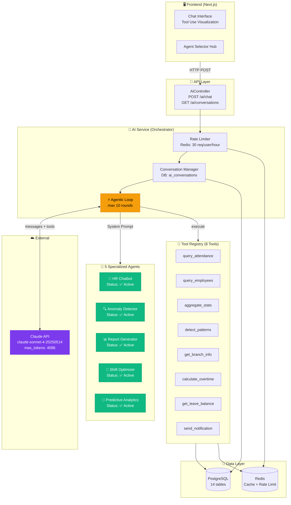
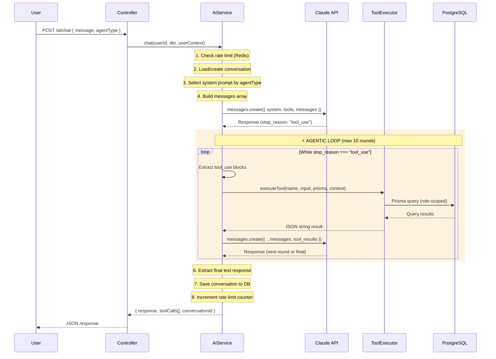
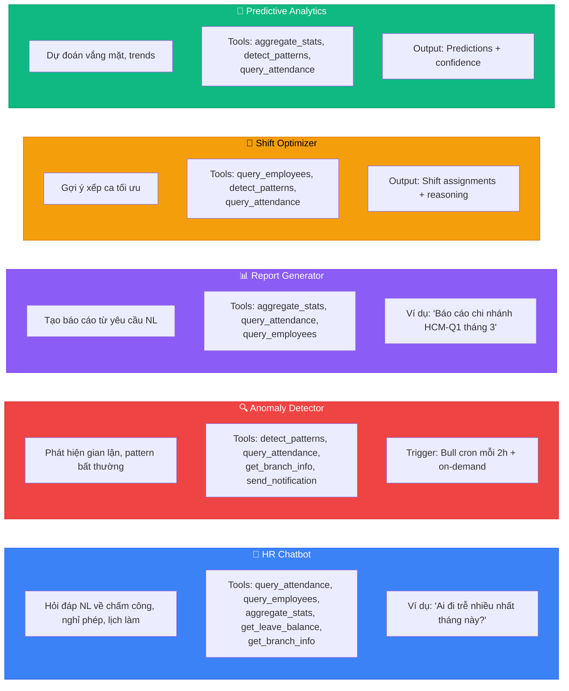
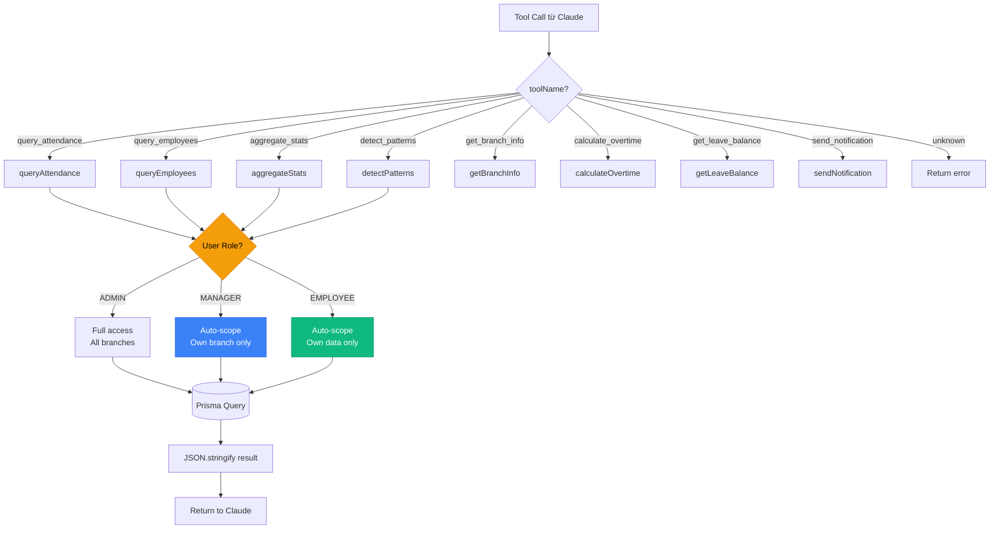
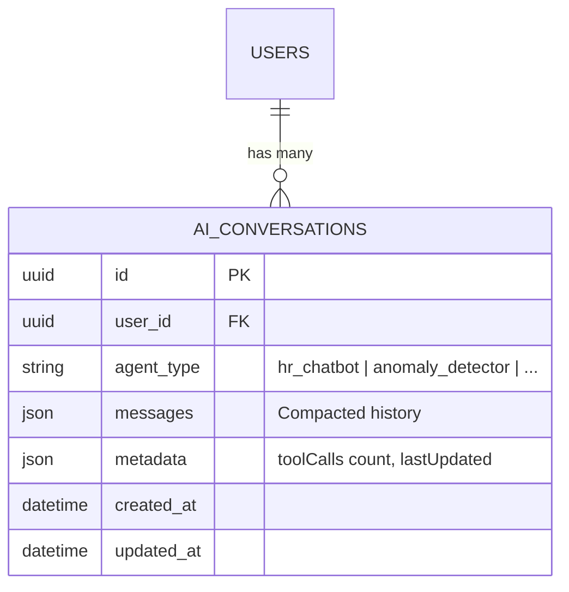
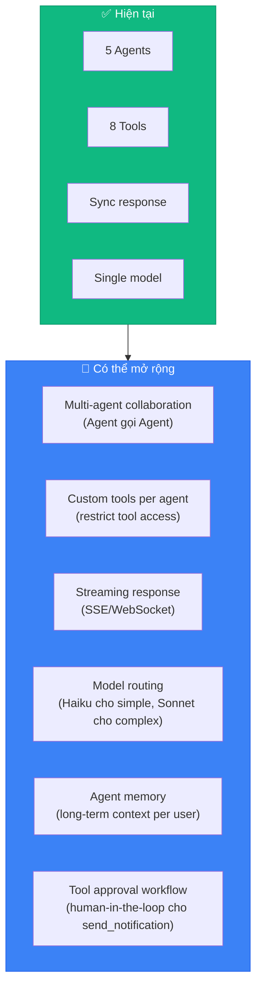

# AI Agent Architecture — Smart Attendance

## 1. Tổng quan hệ thống Agent



## 2. Agentic Loop Flow (Chi tiết)



## 3. Agent Registry — Chi tiết từng Agent



## 4. Tool Registry — Ma trận Agent × Tool

| Tool | HR Chatbot | Anomaly Detector | Report Gen | Shift Opt | Predictive |
|------|:----------:|:----------------:|:----------:|:---------:|:----------:|
| `query_attendance` | ✅ | ✅ | ✅ | ✅ | ✅ |
| `query_employees` | ✅ | ✅ | ✅ | ✅ | ✅ |
| `aggregate_stats` | ✅ | ⬜ | ✅ | ⬜ | ✅ |
| `detect_patterns` | ⬜ | ✅ | ⬜ | ✅ | ✅ |
| `get_branch_info` | ✅ | ✅ | ⬜ | ⬜ | ⬜ |
| `calculate_overtime` | ✅ | ⬜ | ✅ | ⬜ | ⬜ |
| `get_leave_balance` | ✅ | ⬜ | ⬜ | ⬜ | ⬜ |
| `send_notification` | ⬜ | ✅ | ⬜ | ⬜ | ⬜ |

> **Note**: Hiện tại tất cả 8 tools được expose cho tất cả agents. Ma trận trên thể hiện tools **dự kiến** mỗi agent sẽ dùng nhiều nhất. Claude tự quyết định tool nào cần dùng dựa trên system prompt.

## 5. Tool Executor — Security & Scoping



## 6. Conversation Management



**Message compaction**: Chỉ lưu text messages (user + assistant), bỏ raw tool_use/tool_result blocks để tiết kiệm DB storage.

## 7. Rate Limiting

```
Redis Key: ai:rate:{userId}
TTL: 3600s (1 hour)
Max: 30 requests/hour/user

Flow:
1. GET ai:rate:{userId} → count
2. If count >= 30 → HTTP 429 Too Many Requests
3. After successful response → INCR + EXPIRE 3600
```

## 8. File Map

```
packages/backend/src/modules/ai/
├── ai.module.ts              # NestJS module registration
├── ai.controller.ts          # REST endpoints
│   ├── POST /ai/chat         # Main agentic chat
│   ├── GET /ai/conversations # List conversations
│   └── GET /ai/conversations/:id
├── ai.service.ts             # ⚡ CORE: Agentic loop orchestrator
│   ├── chat()                # Main method - runs the loop
│   ├── getConversations()    # List user conversations
│   ├── getConversation()     # Get single conversation
│   ├── checkRateLimit()      # Redis rate limit check
│   ├── incrementRateLimit()  # Redis counter increment
│   └── compactMessages()     # Conversation history compaction
├── dto/
│   └── chat.dto.ts           # { message, agentType, conversationId? }
├── tools/
│   ├── tool-registry.ts      # 8 tool definitions (JSON Schema)
│   └── tool-executor.ts      # Tool → Prisma query execution
└── agents/
    └── agent-prompts.ts      # 5 system prompt templates
```

## 9. Cấu hình & Limits

| Parameter | Value | Location |
|-----------|-------|----------|
| Claude Model | `claude-sonnet-4-20250514` | ai.service.ts:94 |
| Max Tokens | 4096 | ai.service.ts:95 |
| Max Tool Rounds | 10 | ai.service.ts:41 |
| Rate Limit | 30 req/user/hour | ai.service.ts:42 |
| Rate Limit TTL | 3600s (1 hour) | ai.service.ts:340 |
| Tool Result Truncation | 500 chars (for UI) | ai.service.ts:311 |
| Conversation Compaction | Text-only (no tool blocks) | ai.service.ts:283 |

## 10. Mở rộng trong tương lai


